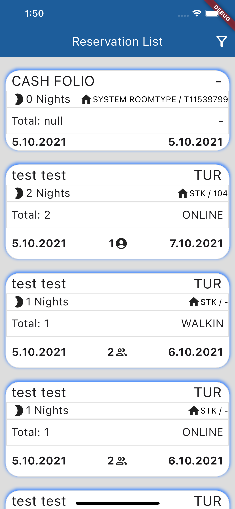
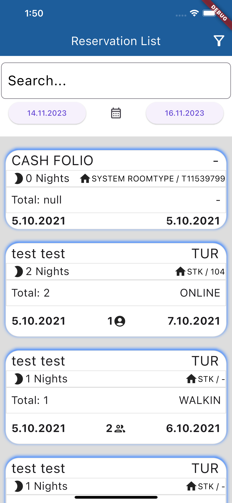
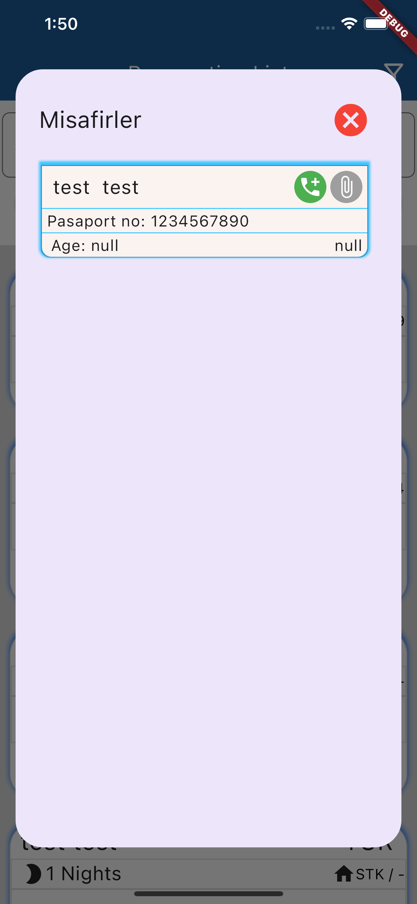

# Hotel Reservation

## Description

Hotel Reservation is a user-friendly and efficient mobile application for managing hotel reservations. This app allows hotel staff to easily track and manage reservations made by guests. By displaying detailed information about reservations and guests, hotel management can provide better service to their customers.

## Features

- **Reservation List:** The app provides a main page where hotel staff can view all reservations. Reservations are listed with guest names, check-in and check-out dates, and other important details.

- **Guest Information:** Users can click on any reservation to view detailed information about the guest, including contact details, special requests, and any other relevant notes.

- **HTTP POST Requests:** The app uses HTTP POST requests to communicate with the server and update reservation details. Postman is utilized for testing and validating these API endpoints.

- **Stream Builder and BehaviorSubject:** Dynamic data is shown and updated using Stream Builder and BehaviorSubject, ensuring smooth and uninterrupted data flow within the app.

## Screenshots

## Installation and Usage

1. Download or clone the project from GitHub: `git clone https://github.com/aliozer0/Hotel-Reservation.git`
2. Install the required dependencies: `flutter pub get`
3. Run the app: `flutter run`

Once the app is launched, hotel staff can view the list of current reservations on the main page and click on each reservation to see detailed guest information.

## Contribution

If you would like to contribute to this project, please follow these steps:

1. Fork the project.
2. Create a new branch: `git checkout -b new-feature`
3. Make your changes and commit them: `git commit -m "Add new feature"`
4. Push to your branch: `git push origin new-feature`
5. Create a Pull Request.

